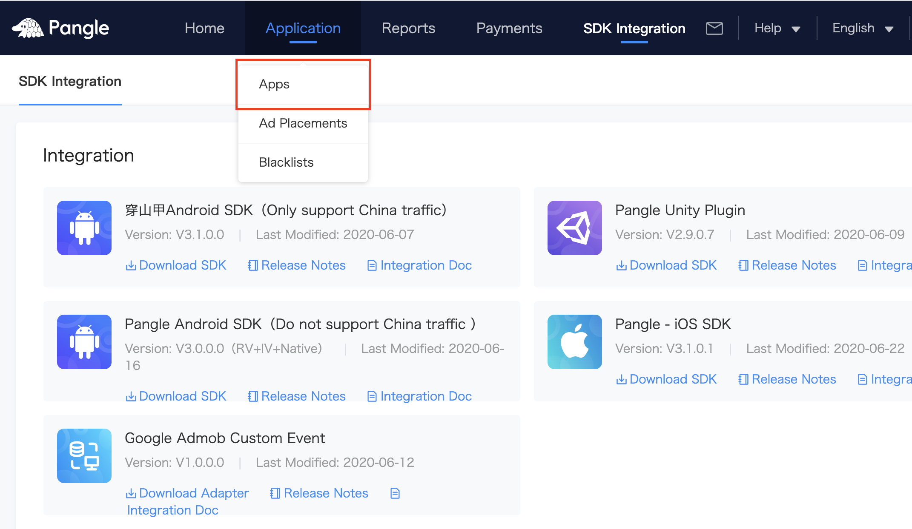
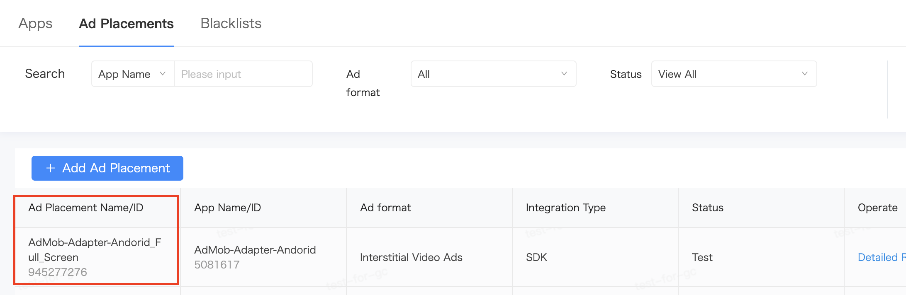

# MoPub Custom Event Adapter for CSJ Ad Network

> Please set [MoPub](https://developers.mopub.com/publishers/ios/integrate/) in your app first.

* Required Steps for integration
  * [Setup CSJ platform](#setup-csj)
  * [Add CSJ to MoPub's mediation](#add-csj)
    * [Adapters for different ad formats](#adapter-file)
  * [Import and initialize CSJ SDK and adapters](#import-csj)
  


<a name="setup-csj"></a>
## Setup Pangle Platform
### Create a Pangle account

- Please create a [Pangle account](https://www.pangleglobal.com) if you do no have one.


### Create an application and placements in Pangle

- Click `Apps` -> `+ Add App` to create a app for mediation.
<br>

<br>


<a name="app-id"></a>
- You will get an app with its `app ID`.
<br>


### Create Ad Placement
- Click `Ad Placements` -> `+ Add Ad Placement` to create the placement for mediation.
<br>


- Select the ad's type for your app and finish the create.
<br>


<a name="placementID"></a>
- You will get a placement with its `placement ID`.
<br>



<a name="add-csj"></a>
## Add Pangle to MoPub's mediation

### Create Order 
- Click `Order` -> `Create Order` to create a new order. If you already have an existing order, please move to the next step.

### Create Line Item

- Click `New Line Item` to create a line item.
<br>


- Select `Network Line Item` to the field `Type & Priority` and select `Custom SDK Network` to the field `Network`
<br>


- Add adapter's class name to Custom Event Class Name.
    - **Class Name**: the adapter class's name , for example,`CSJRewardedVideoCustomEvent`

- Add `{"app_id":"your app id", "ad_placement_id":"your placement id"}` to Custom Event Class Data.
    - **Custom Event Class Data**: Add {"app_id":"[your app id](#app-id)", "ad_placement_id":"[your placement id](#placementID)"} to Custom Event Class Data , for example,`{"app_id":"5000546", "ad_placement_id":"946411987"}`
<br>


  - **Please make sure to use JSON to set Parameter. Or you need to customize adapter yourself.**

- Embed your MoPub Ad Placement to the line item.
<br>


<a name="adapter-file"></a>
### Class name for different ad formats
- Reward Video Ads:`CSJRewardedVideoCustomEvent`
- Interstitial(Fullscreen Video) Ads:`CSJInterstitialCustomEvent`
- Banner Ads:`CSJBannerCustomEvent`
- Native Ads:`CSJNativeCustomEvent`


<a name="import-csj"></a>
## Import and initialize CSJ SDK and Adapter

Add the information as follows in Podfile, and using `pod install` to intergrate.
```
//Import CSJ SDK
pod 'Ads-CN'
//Import CSJ-MoPub Custom Event Adapter
pod "CSJ-mopub-adapter"
```

Initialize `CSJAdapterConfiguration` with the APP ID when you do MoPub SDK initialization, this step is used to initialize CSJ SDK, it's required.

```
    //set up mopub sdk config
    MPMoPubConfiguration *sdkConfig = [[MPMoPubConfiguration alloc] initWithAdUnitIdForAppInitialization:@"5bf96fc264934e838ac8fe8150c01b8f"];
    
    NSMutableDictionary *networkConfig = [NSMutableDictionary dictionaryWithCapacity:2];
    
    NSMutableDictionary *InitConfig = [[NSMutableDictionary alloc] init];
    
    //set your CSJ App Id to value, hardcode app_id for the key name
    [InitConfig setValue:@"Your CSJ APP Id" forKey:@"app_id"];
    
    //init CSJAdapterConfiguration with the config
    NSDictionary *config = @{@"CSJAdapterConfiguration":InitConfig};
    
    [networkConfig addEntriesFromDictionary:config];
    
    Class<MPAdapterConfiguration> BUAdSDKAdapterConfiguration = NSClassFromString(@"CSJAdapterConfiguration");
    sdkConfig.additionalNetworks = @[BUAdSDKAdapterConfiguration];
    
    sdkConfig.mediatedNetworkConfigurations = networkConfig;
    
    [[MoPub sharedInstance] initializeSdkWithConfiguration:sdkConfig completion:^{
        NSLog(@"Mopub initializeSdk");
    }];
```

Please refer to [Integrate Pangle SDK](https://www.pangleglobal.com/support/doc/6034ac60511c57004360ff72)
and [Initialize Pangle SDK](https://www.pangleglobal.com/support/doc/6034ac73511c57004360ff76) for manual integration and more information.


