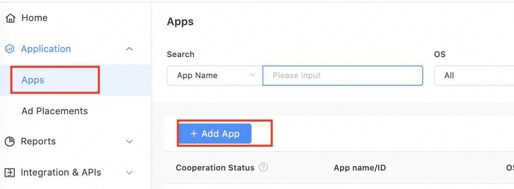
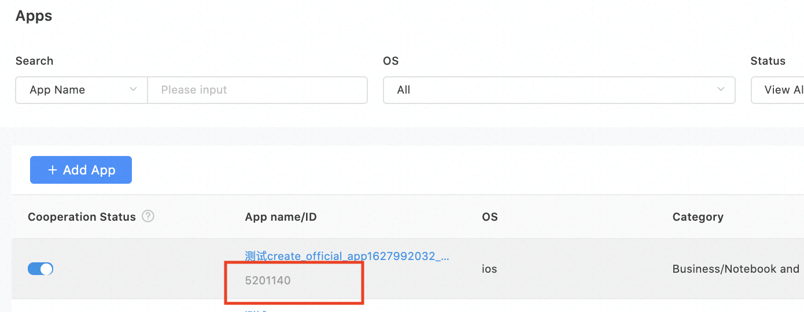
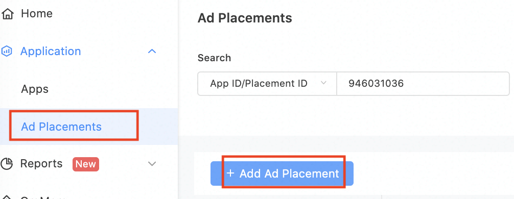
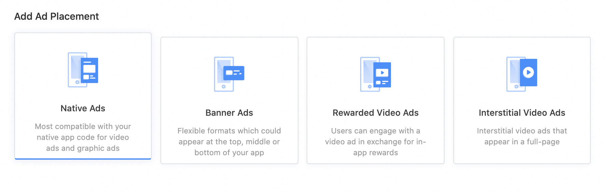
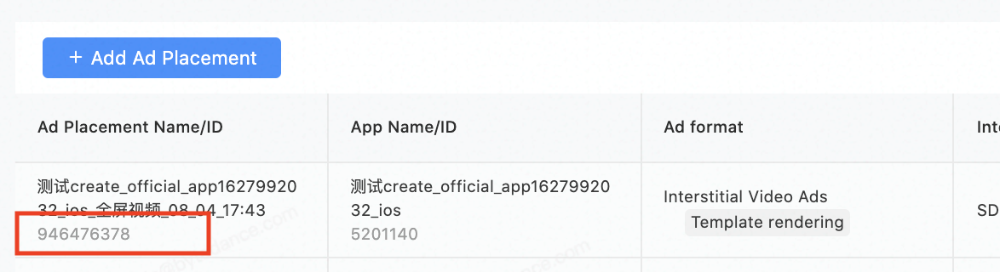
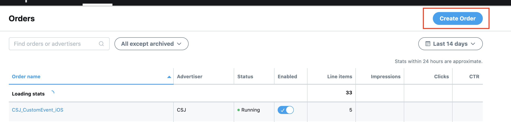
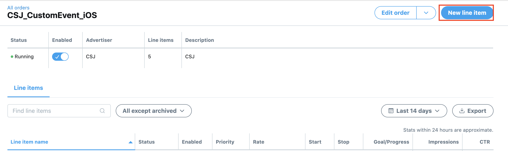
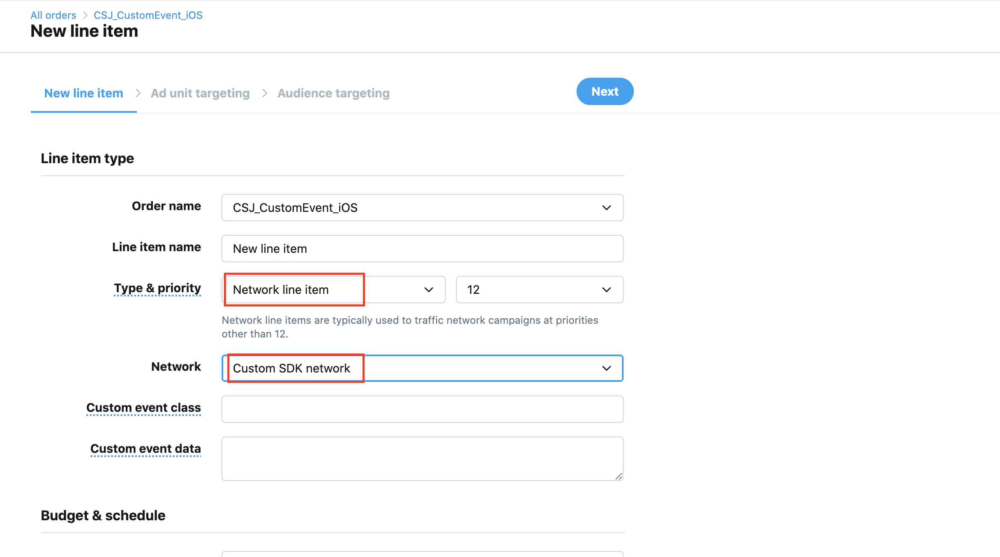
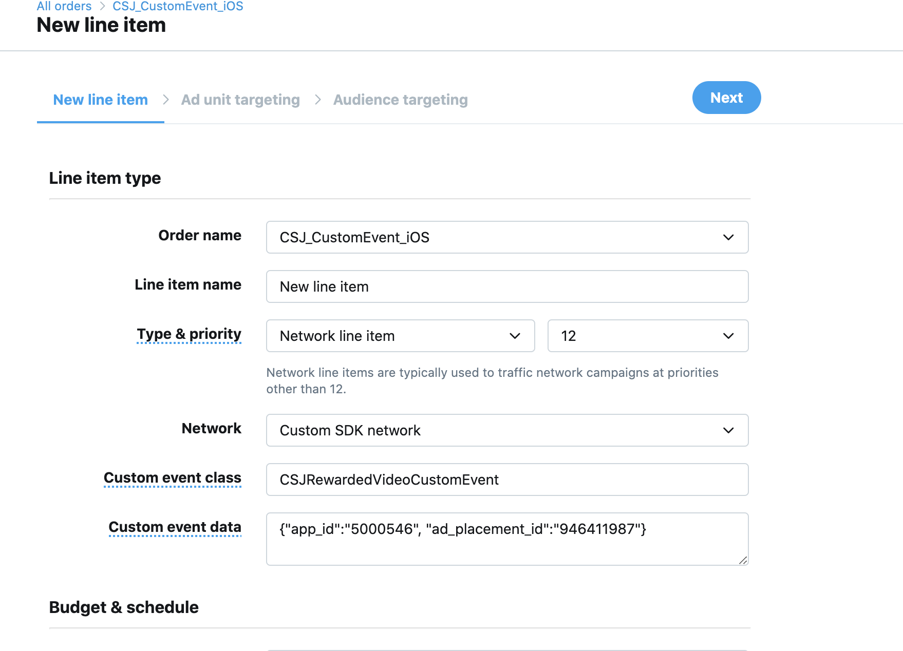
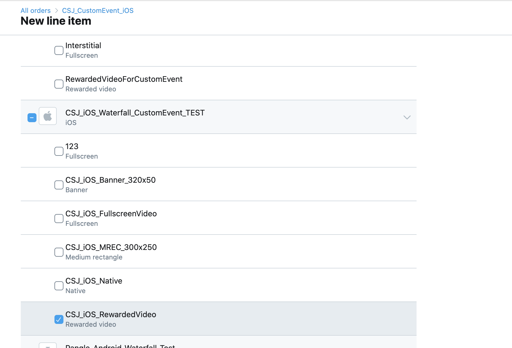

# MoPub Custom Event Adapter for CSJ Ad Network

> Please set [MoPub](https://developers.mopub.com/publishers/ios/integrate/) in your app first.

* Required Steps for integration
  * [Setup CSJ platform](#setup-csj)
  * [Add CSJ to MoPub's mediation](#add-csj)
    * [Adapters for different ad formats](#adapter-file)
  * [Import and initialize CSJ SDK and adapters](#import-csj)
  


<a name="setup-csj"></a>
## Setup CSJ Platform
### Create a CSJ account

- Please create a [CSJ account](https://www.pangle.cn) if you do no have one.


### Create an application and placements in CSJ Platform

- Click `Apps` -> `+ Add App` to create an app for mediation.
<br>


<a name="app-id"></a>
- You will get an app with its `app ID`.
<br>



### Create Ad Placement
- Click `Ad Placements` -> `+ Add Ad Placement` to create the placement for mediation.
<br>


- Select the ad's type for your app and finish the create.
<br>


<a name="placementID"></a>
- You will get a placement with its `placement ID`.
<br>



<a name="add-csj"></a>
## Add CSJ to MoPub's mediation

### Create Order 
- Click `Order` -> `Create Order` to create a new order. If you already have an existing order, please move to the next step.



### Create Line Item

- Click `New Line Item` to create a line item.
<br>



- Select `Network Line Item` to the field `Type & Priority` and select `Custom SDK Network` to the field `Network`
<br>



- Add adapter's class name to Custom Event Class Name.
    - **Class Name**: the adapter class's name , for example,`CSJRewardedVideoCustomEvent`

- Add `{"app_id":"your app id", "ad_placement_id":"your placement id"}` to Custom Event Class Data.
    - **Custom Event Class Data**: Add {"app_id":"[your app id](#app-id)", "ad_placement_id":"[your placement id](#placementID)"} to Custom Event Class Data , for example,`{"app_id":"5000546", "ad_placement_id":"946411987"}`
<br>


  **Note: Please make sure to use JSON to set Custom Event Class Data. Or you need to customize adapter yourself.**

- Embed your MoPub Ad Placement to the line item.
<br>


<a name="adapter-file"></a>
### Class name for different ad formats
- Reward Video Ads:`CSJRewardedVideoCustomEvent`
- Interstitial Video Ads:`CSJInterstitialCustomEvent`
- Banner Ads:`CSJBannerCustomEvent`
- Native Ads:`CSJNativeCustomEvent`


<a name="import-csj"></a>
## Import and initialize CSJ SDK and Adapter

Add the information as follows in Podfile, and using `pod install` to intergrate.
```
//Import CSJ SDK
pod 'Ads-CN'
//Import CSJ-MoPub Custom Event Adapter
pod "CSJ-mopub-adapter"
```


